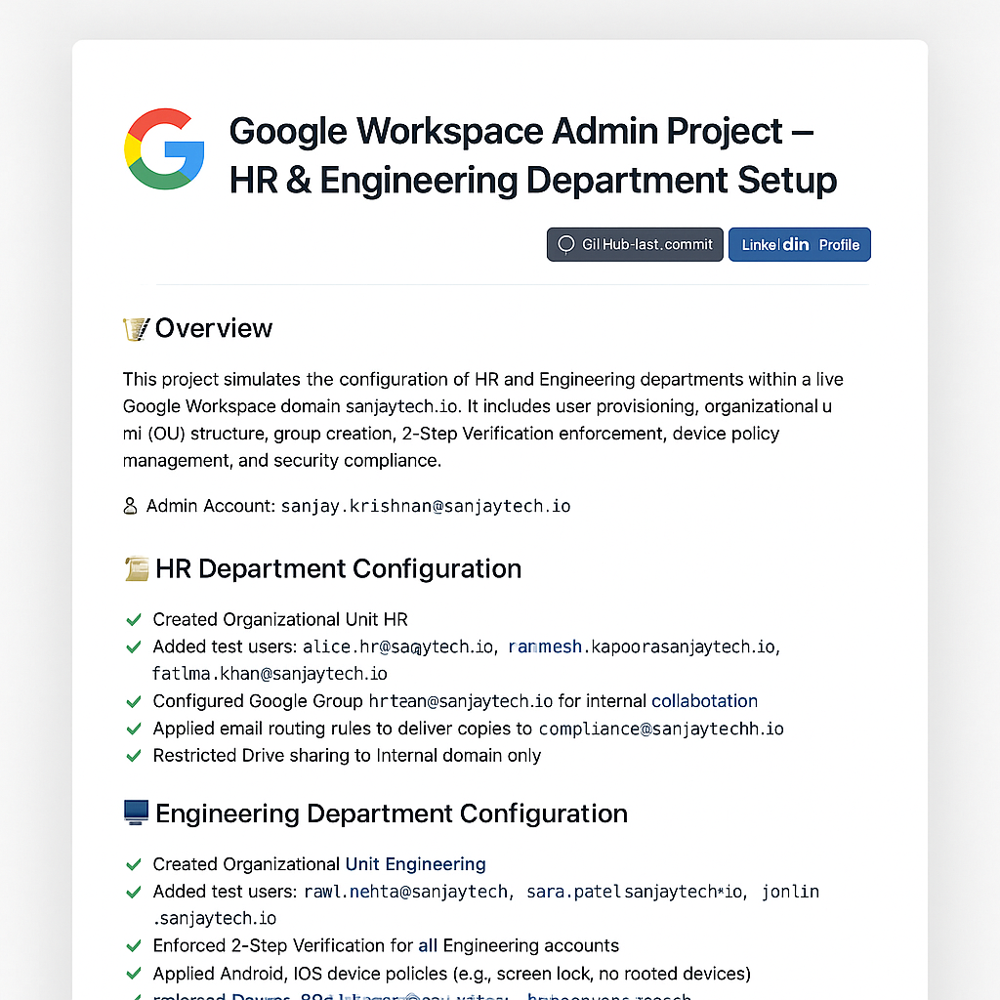
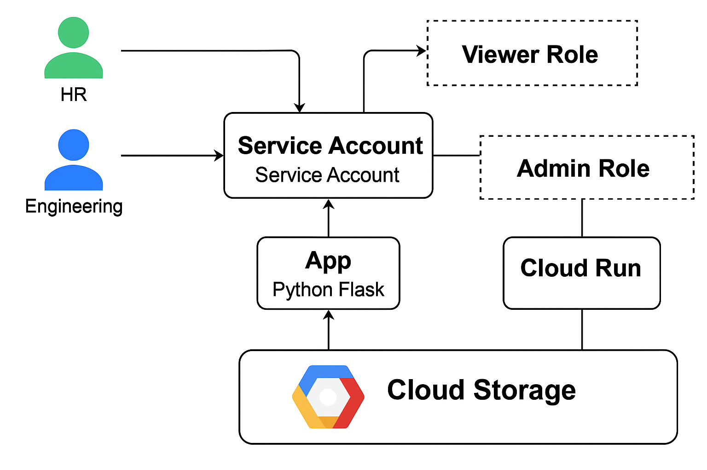

# 💼 IT Projects Portfolio – Sanjay Krishnan

Welcome to my curated portfolio of hands-on IT projects. This repository showcases real-world simulations, system configurations, and administrative solutions that reflect my capabilities in IT support, Google Workspace administration, and cloud-based system management.

---

## 📂 Projects

---

### 🔧 Google Workspace Admin Project – HR & Engineering Setup

Simulated a real-world Google Workspace domain configuration at `sanjaytech.io` for internal departments.

**Key Features:**
- Created Organizational Units for HR and Engineering
- Enforced 2-Step Verification and device security policies
- Set up Google Groups with permission management
- Configured email routing and sharing restrictions
- Automated user onboarding with GAM + Bash scripting
- Documented all work in Markdown and PDF checklist format

📁 [View project folder](google-workspace-admin-project/README.md)  
📸 Screenshot preview:   
📄 Download the checklist: [Engineering_Project_Checklist.pdf](google-workspace-admin-project/Engineering_Project_Checklist.pdf)

---

### 🔐 Cloud IAM & Endpoint Security Project (GCP + Workspace)

A two-phase simulation of identity-based and device-based access management in Google Cloud and Google Workspace.

**Phase 1: IAM Role-Based Access Control**
- Created custom IAM roles for HR and Engineering
- Assigned roles to specific Workspace users via `gcloud`
- Verified role bindings and attempted audit logging
- Documented the full setup with screenshots and scripts

**Phase 2: Context-Aware Access (Simulated)**
- Simulated enforcement of device policies like screen lock, encryption, and endpoint verification
- Created mock screenshots and documentation to show intent and planning
- Explained Workspace edition limitations and how this would be implemented in an Enterprise setup

📁 [View project folder](cloud-iam-security-project/README.md)

---

### ☁️ GCP Application Migration & IAM Security Project

Simulates a real-world cloud migration using GCP services including Cloud Run, IAM, Cloud Storage, and Cloud Logging.

**Project Highlights:**
- Designed and assigned IAM roles for secure access (HR & Engineering)
- Containerized and deployed a Python Flask app using Docker and Cloud Run
- Created Cloud Storage bucket with uniform bucket-level access
- Implemented access logging with audit trails to a dedicated log bucket
- Verified access behavior via simulated service accounts and IAM policies

📁 [View project folder](gcp-application-migration-project/README.md)  
📷 Architecture:   
📝 [Migration Summary](gcp-application-migration-project/documentation/migration-summary.md)

---

### 🛡️ Incident Response Runbook – Google Workspace

A real-world simulation of handling a phishing attack in a Google Workspace environment. This project includes detection, containment, user communication, and post-incident review.

**Key Activities:**
- Triaged phishing message with Admin Console and GAM
- Simulated account compromise response and 2FA enforcement
- Reviewed login activity and OAuth application access
- Created audit log artifacts, GAM limitations, and security notifications
- Documented end-to-end runbook for real-world reference

📁 [View runbook folder](cloud-iam-security-project/incident-response-runbook/)  
📄 [Read the full incident response](cloud-iam-security-project/incident-response-runbook/phishing-incident.md)  
🧾 [Post-Incident Review](cloud-iam-security-project/incident-response-runbook/post-incident-review.md)

---

## 🧰 Core Skills & Tools

- Google Workspace Admin Console
- Google Cloud IAM & Logs Explorer
- GAM (Google Apps Manager)
- GCP CLI (gcloud, gsutil)
- Docker & Cloud Run
- Bash & shell scripting
- IAM & audit policy design
- Markdown & GitHub documentation

---

### 👥 Sample Users Created

| Name          | Email                          | Department  | Alias        |
|---------------|--------------------------------|-------------|--------------|
| Alice HR      | alice.hr@sanjaytech.io         | HR          | a.hr         |
| Ravi Mehta    | ravi.mehta@sanjaytech.io       | Engineering | r.mehta      |
| Priya Menon   | priya.menon@sanjaytech.io      | HR          | p.menon      |

---

### 🔐 Security Measures

- Enforced 2-Step Verification (2FA)
- Blocked rooted/jailbroken mobile access
- IAM roles based on department
- Device policy compliance planning
- Gmail sharing restrictions and email routing for sensitive departments
- GCP Cloud IAM access control & logging for data access

---

### 📂 Full Folder Structure (Simplified)

```
├── google-workspace-admin-project/
│   ├── README.md
│   └── user-lifecycle-automation/
│       └── scripts/gam-onboard.sh
├── cloud-iam-security-project/
│   ├── phase-1-iam/
│   │   ├── README.md
│   │   └── check_iam_logs.sh
│   └── phase-2-endpoint-security/
│       ├── context_aware_access.md
│       └── device_policy_setup.md
│   └── incident-response-runbook/
│       ├── phishing-incident.md
│       ├── post-incident-review.md
│       └── screenshots/
├── gcp-application-migration-project/
│   ├── phase-1-iam-policy-design/
│   ├── phase-2-app-deployment/
│   ├── phase-3-data-access-control/
│   ├── gsutil-scripts/
│   └── documentation/
```

---

## 🧠 About Me

I'm an IT support specialist with hands-on experience managing digital workplaces, Google Workspace, Microsoft systems, and user access policies. I’m passionate about creating secure, efficient, and well-documented IT solutions.

🔗 [LinkedIn Profile](https://www.linkedin.com/in/sanjay-krishnan-aa985b134/)  
📫 Email me: sanjay.krishnan@sanjaytech.io

⭐ **Star this repository** if you'd like to follow more IT system management projects!
