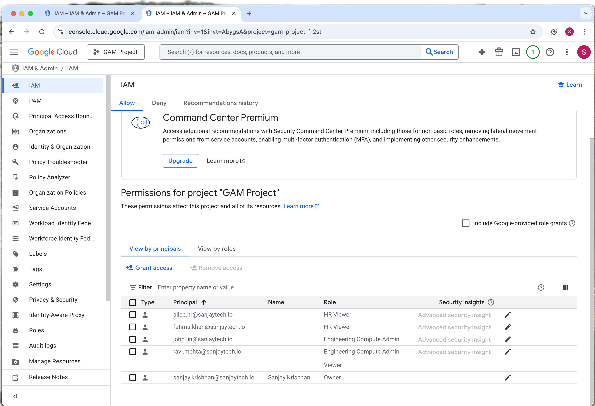
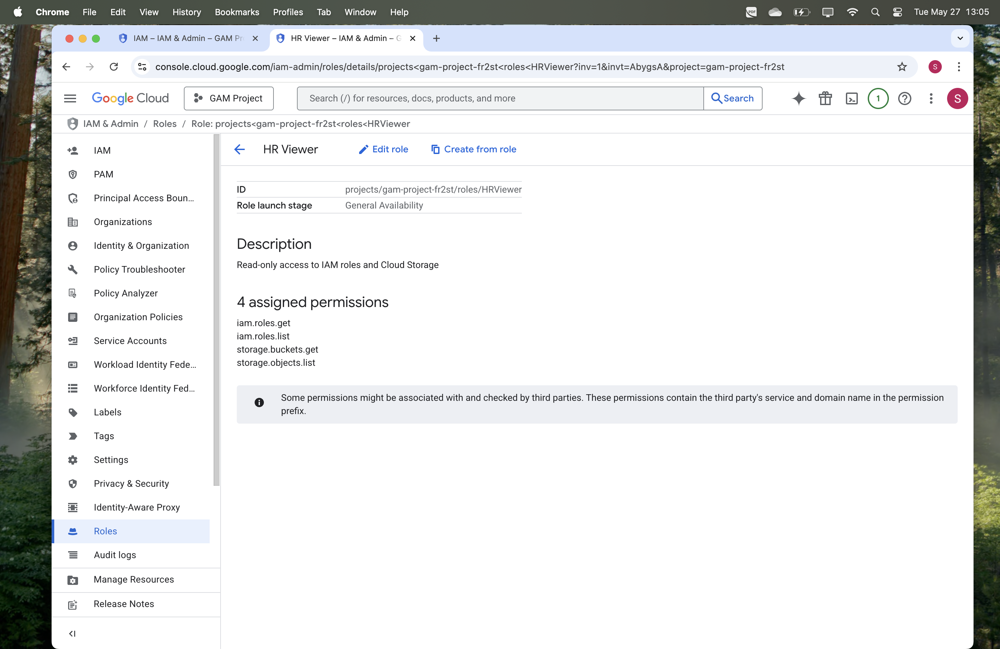
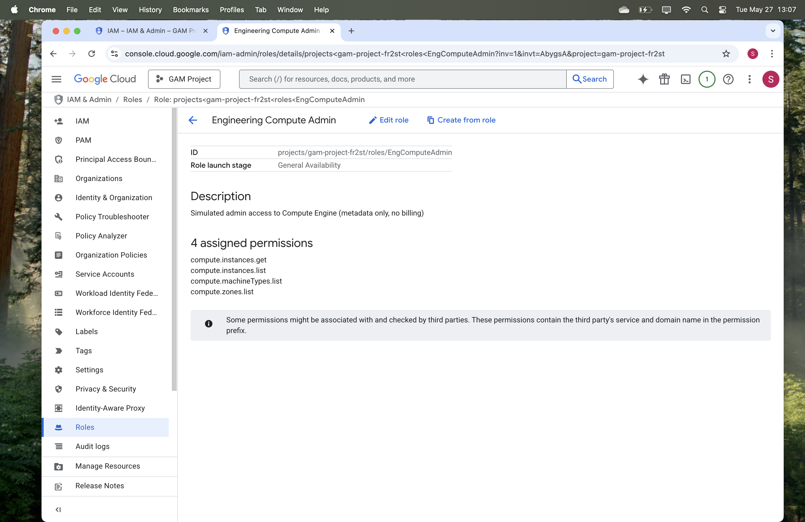
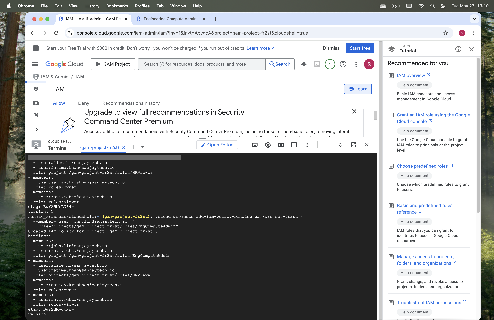
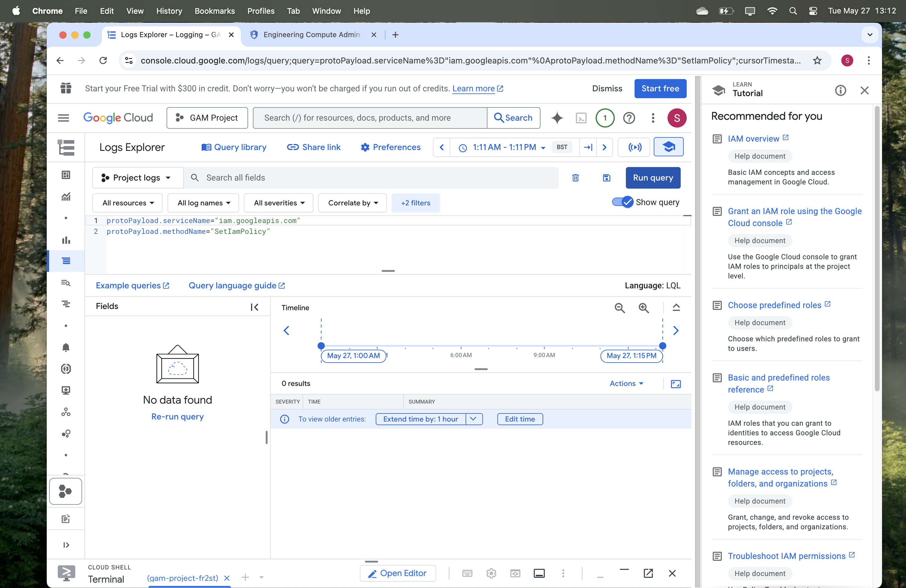

# 🔐 Phase 1 – Role-Based IAM Access Control (Google Cloud)

This project simulates real-world IAM security implementation using **custom roles**, **principle-based access**, and **Cloud Audit Logging** in Google Cloud.

---

## 🎯 Objective

To define least-privilege, department-specific IAM roles for HR and Engineering teams, assign those roles to Workspace users, and validate the access configuration using Cloud Shell and Logs Explorer.

---

## 👥 Roles & Access Configuration

### 📘 Custom IAM Roles Created:
| Role Name | Purpose | Permissions |
|-----------|---------|-------------|
| `HRViewer` | Read-only access to IAM + Cloud Storage metadata | `iam.roles.get`, `iam.roles.list`, `storage.buckets.get`, `storage.objects.list` |
| `EngComputeAdmin` | View-only access to Compute Engine resources | `compute.instances.get`, `compute.instances.list`, `compute.zones.list`, `compute.machineTypes.list` |

---

### 🧑‍💻 Users & Roles Assigned:
| User | Assigned Role(s) |
|------|------------------|
| `alice.hr@sanjaytech.io` | HRViewer |
| `fatima.khan@sanjaytech.io` | HRViewer |
| `ravi.mehta@sanjaytech.io` | EngComputeAdmin + Viewer |
| `john.lin@sanjaytech.io` | EngComputeAdmin |
| `sanjay.krishnan@sanjaytech.io` | Owner |

---

## 🔧 Tools Used
- Google Cloud IAM & Admin Console
- `gcloud` CLI in Cloud Shell
- Cloud Logs Explorer
- Custom Role API bindings

---

## 🖼️ Screenshots

| Screenshot | Description |
|------------|-------------|
|  | IAM overview of assigned roles |
|  | Permissions inside HRViewer role |
|  | Permissions inside EngComputeAdmin |
|  | Terminal output after binding users |
|  | IAM audit query via Logs Explorer |

---

## 📋 Outcome

✅ Custom IAM roles created and assigned  
✅ Verified using `gcloud` output  
✅ Attempted audit logging via Logs Explorer (no data yet due to indexing delay)  
✅ Clean folder structure and documentation for GitHub visibility

---

## 🔮 Next Phase

👉 [Phase 2 – Context-Aware Access & Endpoint Security](../phase-2-endpoint-security/context_aware_access.md)

Focus: Enforce access restrictions based on device trust, screen lock, encryption, and OS platform.

